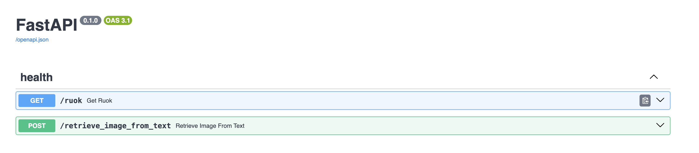

A repo for cool image, text retrieval using OpenAI's [ClIP](https://arxiv.org/abs/2103.00020) model. For information about how CLIP works see my
article on [Medium](https://medium.com/@paluchasz/understanding-openais-clip-model-6b52bade3fa3).

## Data
Using the following Flickr 8K dataset from [Kaggle](https://www.kaggle.com/datasets/adityajn105/flickr8k). It contains a variety of images each paired
with 5 different captions.

## Running Locally
1. Install all the dependencies with [poetry](https://python-poetry.org/) using `poetry install`. It is recommended to have the virtual environments
created inside the project with the `poetry config virtualenvs.prefer-active-python true` command.
2. The first step is to pre-compute the image embeddings with the `image_text_retrieval/scripts/pre_compute_embeddings.py` script. This script can
be ran with the `pre_compute_embeddings` command. It uses dvc to store the script parameters which can be changed in the `params.yaml` file. It
expects a directory of images (`data/images` by default) and it saves out the embeddings a mapping file in two different files.
3. To run the backend api use the command `image_text_retrieval_api` and go to `http://0.0.0.0:8000/docs` in the browser to get an interactive swagger:

